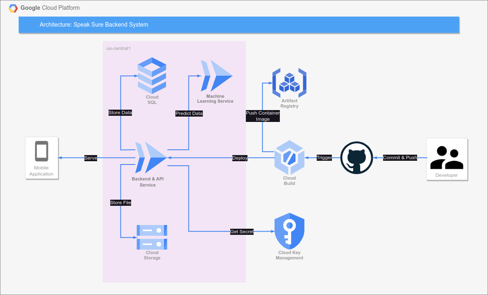

## API Documentation

url : https://speak-sure-dzjerbarfq-uc.a.run.app

<details>

<summary>POST /auth/register</summary>

### POST /auth/register

#### Body

| Key      | Type   | Default | Required | Description      |
| -------- | ------ | ------- | -------- | ---------------- |
| name     | String |         | Yes      | Name of the user |
| email    | String |         | Yes      | User email       |
| password | String |         | Yes      | User password    |

#### Successful response

> Register successfully (201)
>
> ```JSON
> {
>   "statusCode": 201,
>   "data": [
>     {
>       "id": 123,
>       "access_token": "xxx"
>     }
>   ]
> }
> ```

#### Failed response

> Required field didn't filled properly (400)
>
> ```JSON
> {
>   "statusCode": 400,
>   "message": [
>       "xxx",
>       "xxx",
>   ],
>   "error": "Bad Request"
> }
> ```

> Email already exists (400)
>
> ```JSON
> {
>   "statusCode": 400,
>   "message": "Email already exists"
> }
> ```

</details>

<details>
<summary>POST /auth/login</summary>

### POST /auth/login

#### Body

| Key      | Type   | Default | Required | Description   |
| -------- | ------ | ------- | -------- | ------------- |
| email    | String |         | Yes      | User email    |
| password | String |         | Yes      | User password |

#### Successful response

> Login successfully (200)
>
> ```JSON
> {
>   "statusCode": 200,
>   "data": [
>     {
>       "id": 123,
>       "access_token": "xxx"
>     }
>   ]
> }
> ```

#### Failed response

> Wrong Username / Password (400)
>
> ```JSON
> {
>   "statusCode": 401,
>   "message": "Unauthorized"
> }
> ```

> Required field didn't filled properly (400)
>
> ```JSON
> {
>   "statusCode": 400,
>   "message": [
>       "xxx",
>       "xxx",
>   ],
>   "error": "Bad Request"
> }
> ```

</details>

<details>
<summary>PATCH /user/{user_id}</summary>

### PATCH /user/{user_id}

#### Header

| Name          | Type   | Default | Required | Value                             |
| ------------- | ------ | ------- | -------- | --------------------------------- |
| Authorization | Bearer |         | Yes      | Auth token from register or login |

#### Params

| Name    | Type    | In  | Default | Required | Description    |
| ------- | ------- | --- | ------- | -------- | -------------- |
| user_id | Integer | Uri |         | Yes      | The ID of user |

#### Body

| Name     | Type   | Default | Required | Description             |
| -------- | ------ | ------- | -------- | ----------------------- |
| name     | String |         | No       | Name of user            |
| email    | String |         | No       | Email of user           |
| password | String |         | No       | Password of user        |
| image    | File   |         | No       | Profile picture of user |
| audio    | File   |         | No       | Profile audio of user   |
| badge    | Number |         | No       | Id of the badge         |

#### Response

##### Successful response

> Successfully change user data (200)
>
> ```JSON
> {
>   "statusCode": 200,
>   "data": [
>     {
>       "id": 1,
>       "name": "xxx",
>       "email": "xxx@xxx.xxx",
>       "audio": "xxx",
>       "audio_length": 12.3,
>       "image": "xxx",
>       "status": "xxx",
>       "badge": "123",
>       "created_at": "123",
>       "updated_at": "123"
>     }
>   ]
> }
> ```

##### Failed response

> Id from token does not match user_id (403)
>
> ```JSON
> {
>   "statusCode": 403,
>   "message": "Forbidden"
> }
> ```

</details>

<details>
<summary>GET /user/{user_id}</summary>

### GET /user/{user_id}

#### Header

| Name          | Type   | Default | Required | Value                             |
| ------------- | ------ | ------- | -------- | --------------------------------- |
| Authorization | Bearer |         | Yes      | Auth token from register or login |

#### Params

| Name    | Type    | In  | Default | Required | Description    |
| ------- | ------- | --- | ------- | -------- | -------------- |
| user_id | Integer | Uri |         | Yes      | The ID of user |

#### Response

##### Successful response

> Successfully get user data (200)
>
> ```JSON
> {
>   "statusCode": 200,
>   "data": {
>     "id": 1,
>     "name": "xxx",
>     "email": "xxx@xxx.xxx",
>     "audio": "xxx",
>     "audio_length": "xxx",
>     "image": "xxx",
>     "status": "xxx",
>     "threads_count": "123",
>     "comments_count": "123",
>     "created_at": "123",
>     "updated_at": "123",
>     "badge": {
>         "id": 1,
>         "title": "xxx",
>         "image": "xxx"
>     }
>   }
> }
> ```

##### Failed response

> Id from token does not match user_id (403)
>
> ```JSON
> {
>   "statusCode": 403,
>   "message": "Forbidden"
> }
> ```

</details>

<details>
<summary>DELETE /user/{user_id}</summary>

### DELETE /user/{user_id}

#### Header

| Name          | Type   | Default | Required | Value                             |
| ------------- | ------ | ------- | -------- | --------------------------------- |
| Authorization | Bearer |         | Yes      | Auth token from register or login |

#### Params

| Name    | Type    | In  | Default | Required | Description    |
| ------- | ------- | --- | ------- | -------- | -------------- |
| user_id | Integer | Uri |         | Yes      | The ID of user |

#### Response

##### Successful response

> Successfully delete the user (204)

##### Failed response

> Id of token does not match user_id (403)
>
> ```JSON
> {
>   "statusCode": 403,
>   "message": "Forbidden"
> }
> ```

> User doesn't exists (400)
>
> ```JSON
> {
>     "statusCode": 400,
>     "message": "User doesn't exists"
> }
> ```

</details>

<details>
<summary>POST /threads</summary>

### POST /threads

#### Header

| Name          | Type   | Default | Required | Value                             |
| ------------- | ------ | ------- | -------- | --------------------------------- |
| Authorization | Bearer |         | Yes      | Auth token from register or login |

#### Body

| Key         | Type   | Default | Required | Description           |
| ----------- | ------ | ------- | -------- | --------------------- |
| title       | String |         | Yes      | Name of thread        |
| description | String |         | Yes      | Description of thread |
| topic       | String |         | Yes      | Topic of thread       |
| image       | File   |         | No       | Image of thread       |
| audio       | File   |         | No       | Audio of thread       |

#### Response

##### Successful response

> Successfully created new thread (200)
>
> ```JSON
> {
>   "statusCode": 200,
>   "data": [
>     {
>       "id": ,
>       "title": "xxx",
>       "description": "xxx",
>       "topic": "xxx",
>       "image": "xxx",
>       "audio": "xxx",
>       "audio_length": 12.3
>     }
>   ]
> }
> ```

> audio_length is provided in seconds

##### Failed response

> Invalid Token (401)
>
> ```JSON
> {
>   "statusCode": 401,
>   "message": "Unauthorized"
> }
> ```

> Required field didn't filled properly (400)
>
> ```JSON
> {
>   "statusCode": 400,
>   "message": [
>     "title should not be empty",
>     "description should not be empty",
>     "topic should not be empty"
>   ],
>   "error": "Bad Request"
> }
> ```

> Topic doesn't exists (400)
>
> ```JSON
> {
>   "statusCode": 400,
>   "message": "The topic doesn't exists"
> }
> ```

> Incompatible Files (422)
>
> ```JSON
> {
>   "statusCode": 422,
>   "message": "audio is not a valid document. Accepted file format [mp3,wav,mpeg]"
> }
> ```

> Title or Description contains flag word (400)
<<<<<<< HEAD
> ```JSON
>	{
>	    "statusCode": 400,
>	    "message": "Text contains flagged words toxic, obscene, insult"
>	}
> ``` 
\* The message could be : 
=======
>
> ```JSON
> 	{
> 	    "statusCode": 400,
> 	    "message": "Text contains flagged words toxic, obscene, insult"
> 	}
> ```
>
> \* The message could be :

>>>>>>> c48c20c (add How-to-Install and fix minor changes in documentation)
        labels = ['toxic', 'severe toxic', 'obscene', 'threat', 'insult', 'identity hate']

</details>

<details>
<summary>PATCH /threads/{thread_id}</summary>

### PATCH /threads/{thread_id}

#### Header

| Name          | Type   | Default | Required | Value                             |
| ------------- | ------ | ------- | -------- | --------------------------------- |
| Authorization | Bearer |         | Yes      | Auth token from register or login |

#### Params

| Name      | Type    | In  | Default | Required | Description      |
| --------- | ------- | --- | ------- | -------- | ---------------- |
| thread_id | Integer | Uri |         | Yes      | The ID of thread |

#### Body

| Key         | Type   | Default | Required | Description           |
| ----------- | ------ | ------- | -------- | --------------------- |
| title       | String |         | No       | Name of thread        |
| description | String |         | No       | Description of thread |
| topic       | String |         | No       | Topic of thread       |
| image       | File   |         | No       | Image of thread       |
| audio       | File   |         | No       | Audio of thread       |

#### Response

##### Successful response

> Successfully updated the thread (200)
>
> ```JSON
> {
>   "statusCode": 201,
>   "data": {
>     "id": 1,
>     "title": "xxx",
>     "description": "xxx",
>     "topic": "123",
>     "image": "xxx",
>     "audio": "xxx",
>     "audio_length": 12.3,
>     "updated_at": "123"
>   }
> }
> ```

> audio_length is provided in seconds

##### Failed response

> Thread doesn't exists (400)
>
> ```JSON
> {
>     "statusCode": 400,
>     "message": "Thread doesn't exists"
> }
> ```

> Topic doesn't exists (400)
>
> ```JSON
> {
>   "statusCode": 400,
>   "message": "The topic doesn't exists"
> }
> ```

> Title or Description contains flag word (400)
<<<<<<< HEAD
> ```JSON
>	{
>	    "statusCode": 400,
>	    "message": "Text contains flagged words toxic, obscene, insult"
>	}
> ``` 
\* The message could be : 
=======
>
> ```JSON
> 	{
> 	    "statusCode": 400,
> 	    "message": "Text contains flagged words toxic, obscene, insult"
> 	}
> ```
>
> \* The message could be :

>>>>>>> c48c20c (add How-to-Install and fix minor changes in documentation)
        labels = ['toxic', 'severe toxic', 'obscene', 'threat', 'insult', 'identity hate']

</details>

<details>
<summary>GET /threads</summary>

### GET /threads

#### Params

| Name    | Type   | In    | Default | Required | Description                      |
| ------- | ------ | ----- | ------- | -------- | -------------------------------- |
| page    | string | Query | 0       | No       | The index of page of list thread |
| size    | string | Query | 5       | No       | Max thread in one page           |
| keyword | string | Query |         | No       | Keyword for search the thread    |
| topic   | string | Query |         | No       | The topic of the thread          |

#### Response

##### Successful response

> Successfully get the thread (200)
>
> ```JSON
> {
>   "statusCode": 200,
>   "data": [
>     {
>       "id": 1,
>       "title": "xxx",
>       "description": "xxx",
>       "comments_count": "123",
>       "likes_count": "123",
>       "image": "xxx",
>       "audio": "xxx",
>       "audio_length": 12.3,
>       "created_at": "123",
>       "updated_at": "123",
>       "user": {
>           "name": "xxx",
>           "image": "xxx"
>       },
>       "topic": {
>           "id": 1,
>           "name": "xxx"
>       }
>     }
>   ]
> }
> ```

> audio_length is provided in seconds

</details>

<details>
<summary>GET /threads/{thread_id}</summary>

### GET /threads

#### Params

| Name      | Type   | In  | Default | Required | Description          |
| --------- | ------ | --- | ------- | -------- | -------------------- |
| thread_id | string | Uri |         | Yes      | The id of the thread |

#### Response

##### Successful response

> Successfully get the thread (200)
>
> ```JSON
> {
> "statusCode": 200,
>   "data": {
>     "id": 1,
>     "title": "xxx",
>     "description": "xxx",
>     "comments_count": "123",
>     "likes_count": "123",
>     "topic": "xxx",
>     "image": "xxx",
>     "audio": "xxx",
>     "audio_length": "123",
>     "created_at": "123",
>     "updated_at": "123",
>     "user": {
>         "name": "xxx",
>         "image": "xxx"
>     }
>   }
> }
> ```

> audio_length is provided in seconds

##### Failed response

> Thread doesn't exists (400)
>
> ```JSON
> {
>   "statusCode": 400,
>   "message": "Thread doesn't exists"
> }
> ```

</details>

<details>
<summary>DELETE /threads/{thread_id}</summary>

### DELETE /threads/{thread_id}

#### Header

| Name          | Type   | Default | Required | Value                             |
| ------------- | ------ | ------- | -------- | --------------------------------- |
| Authorization | Bearer |         | Yes      | Auth token from register or login |

#### Params

| Name      | Type    | In  | Default | Required | Description      |
| --------- | ------- | --- | ------- | -------- | ---------------- |
| thread_id | Integer | Uri |         | Yes      | The ID of thread |

#### Response

##### Successful response

> Successfully delete the thread (204)

##### Failed response

> Id from the token does not match with the creator of thread (403)
>
> ```JSON
> {
>   "statusCode": 403,
>   "message": "Forbidden"
> }
> ```

> Thread doesn't exists (400)
>
> ```JSON
> {
>     "statusCode": 400,
>     "message": "Thread doesn't exists"
> }
> ```

</details>

<details>
<summary>POST /threads/{thread_id}/likes</summary>

### POST /threads/{thread_id}/likes

#### Header

| Name          | Type   | Default | Required | Value                             |
| ------------- | ------ | ------- | -------- | --------------------------------- |
| Authorization | Bearer |         | Yes      | Auth token from register or login |

#### Params

| Name      | Type    | In  | Default | Required | Description      |
| --------- | ------- | --- | ------- | -------- | ---------------- |
| thread_id | Integer | Uri |         | Yes      | The ID of thread |

#### Response

##### Successful response

> Successfully like the thread (201)

```JSON
{
  "statusCode": 201,
  "data": {
    "thread_id": 1
  }
}
```

##### Failed response

> Thread doesn't exists (400)
>
> ```JSON
> {
>   "statusCode": 400,
>   "message": "Thread doesn't exists"
> }
> ```

> Already liked the Thread (400)
>
> ```JSON
> {
>   "statusCode": 400,
>   "message": "Thread already liked"
> }
> ```

</details>

<details>
<summary>DELETE /threads/{thread_id}/likes</summary>

### DELETE /threads/{thread_id}/likes

#### Header

| Name          | Type   | Default | Required | Value                             |
| ------------- | ------ | ------- | -------- | --------------------------------- |
| Authorization | Bearer |         | Yes      | Auth token from register or login |

#### Params

| Name      | Type    | In  | Default | Required | Description      |
| --------- | ------- | --- | ------- | -------- | ---------------- |
| thread_id | Integer | Uri |         | Yes      | The ID of thread |

#### Response

##### Successful response

> Successfully unlike the thread (204)

##### Failed response

> Thread doesn't exists (400)
>
> ```JSON
> {
>   "statusCode": 400,
>   "message": "Thread doesn't exists"
> }
> ```

> Thread didn't liked yet (400)
>
> ```JSON
> {
>   "statusCode": 400,
>   "message": "Thread didn't liked yet"
> }
> ```

</details>

<details>
<summary>POST /topics</summary>

### POST /topics

#### Header

| Name          | Type   | Default | Required | Value                             |
| ------------- | ------ | ------- | -------- | --------------------------------- |
| Authorization | Bearer |         | Yes      | Auth token from register or login |

#### Body

| Key  | Type   | Default | Required | Description       |
| ---- | ------ | ------- | -------- | ----------------- |
| name | String |         | Yes      | Name of the topic |

#### Successful response

> Topic created successfully (201)
>
> ```JSON
> {
>   "statusCode": 201,
>   "data": {
>     "name": "xxx",
>     "id": 1
>   }
> }
> ```

#### Failed response

> Required field didn't filled properly (400)
>
> ```JSON
> {
>   "statusCode": 400,
>   "message": [
>       "xxx",
>   ],
>   "error": "Bad Request"
> }
> ```

> Topic already exists (400)
>
> ```JSON
> {
>   "statusCode": 400,
>   "message": "The topic already exists"
> }
> ```

</details>

<details>
<summary>PATCH /topics/{topic_id}</summary>

### PATCH /topics/{topic_id}

#### Header

| Name          | Type   | Default | Required | Value                             |
| ------------- | ------ | ------- | -------- | --------------------------------- |
| Authorization | Bearer |         | Yes      | Auth token from register or login |

#### Params

| Name     | Type    | In  | Default | Required | Description     |
| -------- | ------- | --- | ------- | -------- | --------------- |
| topic_id | Integer | Uri |         | Yes      | The ID of topic |

#### Body

| Key  | Type   | Default | Required | Description       |
| ---- | ------ | ------- | -------- | ----------------- |
| name | String |         | No       | Name of the topic |

#### Successful response

> Topic updated successfully (200)
>
> ```JSON
> {
>   "statusCode": 200,
>   "data": {
> 	"id": 1,
>     "name": "xxx"
>   }
> }
> ```

#### Failed response

> Topic doesn't exists (400)
>
> ```JSON
> {
>   "statusCode": 400,
>   "message": "The topic doesn't exists"
> }
> ```

</details>

<details>
<summary>GET /topics</summary>

### GET /topics

#### Header

| Name          | Type   | Default | Required | Value                             |
| ------------- | ------ | ------- | -------- | --------------------------------- |
| Authorization | Bearer |         | Yes      | Auth token from register or login |

#### Successful response

> Successfully get topic data (200)
>
> ```JSON
> {
>   "statusCode": 200,
>   "data": [
>      {
>       "id": 1,
>        "name": "xxx",
>      },
>      {
>       "id": 2,
>        "name": "xxx",
>      },
>      ...
>   ]
> }
> ```

</details>

<details>
<summary>DELETE /topics/{topic_id}</summary>

### DELETE /topics/{topic_id}

#### Header

| Name          | Type   | Default | Required | Value                             |
| ------------- | ------ | ------- | -------- | --------------------------------- |
| Authorization | Bearer |         | Yes      | Auth token from register or login |

#### Params

| Name     | Type    | In  | Default | Required | Description     |
| -------- | ------- | --- | ------- | -------- | --------------- |
| topic_id | Integer | Uri |         | Yes      | The ID of topic |

#### Successful response

> Topic updated successfully (204)

#### Failed response

> Topic doesn't exists (400)
>
> ```JSON
> {
>   "statusCode": 400,
>   "message": "The topic doesn't exists"
> }
> ```

</details>

<details>
<summary>POST /threads/{thread_id}/comments</summary>

### POST /threads/:thread_id/comments

#### Header

| Name          | Type   | Default | Required | Value                             |
| ------------- | ------ | ------- | -------- | --------------------------------- |
| Authorization | Bearer |         | Yes      | Auth token from register or login |

#### Params

| Name      | Type    | Default | Required | Description              |
| --------- | ------- | ------- | -------- | ------------------------ |
| thread_id | Integer |         | Yes      | Thread ID of the comment |
| text      | String  |         | Yes      | Message                  |
| audio     | File    |         |          | Audio of the comment     |

#### Successful response

> Successfully created new thread (201)
>
> ```JSON
> {
> 	  "statusCode": 201,
>   "data": [
>     {
>       "id":  xx,
>       "thread_id": xxx,
>       "text": "xxx",
>       "audio": "xxx",
>       "audio_length": xx,
>       "created_at": "xxx"
>     }
>   ]
> }
> ```

##### Failed response

> Invalid Token (401)
>
> ```JSON
> {
>   "statusCode": 401,
>   "message": "Unauthorized"
> }
> ```

> Required field didn't filled properly (400)
>
> ```JSON
> {
>   "statusCode": 400,
>   "message": [
>     "text should not be empty"
>   ],
>   "error": "Bad Request"
> }
> ```

> Incompatible Files (422)
>
> ```JSON
> {
>   "statusCode": 422,
>   "message": "audio is not a valid document. Accepted file format [mp3,wav,mpeg]"
> }
> ```

> Thread doesn't exist(400)
<<<<<<< HEAD
=======
>
>>>>>>> c48c20c (add How-to-Install and fix minor changes in documentation)
> ```JSON
> {
>   "statusCode": 400,
>   "message": "Thread doesn't exists"
> }
> ```

> Use doesn't exist(400)
<<<<<<< HEAD
=======
>
>>>>>>> c48c20c (add How-to-Install and fix minor changes in documentation)
> ```JSON
> {
>   "statusCode": 400,
>   "message": "User doesn't exists"
> }
> ```

> Text contains flag word (400)
<<<<<<< HEAD
> ```JSON
>	{
>	    "statusCode": 400,
>	    "message": "Text contains flagged words toxic, obscene, insult"
>	}
> ``` 
\* The message could be : 
=======
>
> ```JSON
> 	{
> 	    "statusCode": 400,
> 	    "message": "Text contains flagged words toxic, obscene, insult"
> 	}
> ```
>
> \* The message could be :

>>>>>>> c48c20c (add How-to-Install and fix minor changes in documentation)
        labels = ['toxic', 'severe toxic', 'obscene', 'threat', 'insult', 'identity hate']

</details>
 
<details>
<summary>GET /threads/{thread_id}/comments/:comment_id</summary>

### GET /threads/:thread_id/comments/:comment_id

#### Header

| Name          | Type   | Default | Required | Value                             |
| ------------- | ------ | ------- | -------- | --------------------------------- |
| Authorization | Bearer |         | Yes      | Auth token from register or login |

#### Params

| Name      | Type    | Default | Required | Description               |
| --------- | ------- | ------- | -------- | ------------------------- |
| thread_id | Integer |         | Yes      | Thread ID of the comment  |
| commentId | String  |         | Yes      | Comment ID of the comment |

#### Successful response

> Successfully created new thread (200)
>
> ```JSON
> {
>   "statusCode": 200,
>   "data": {
>     {
>       "id": x,
>       "text": "xxx",
>       "likes_count": x,
>       "audio": "xxx",
>       "audio_length": xxx,
>       "created_at": "xxx",
>       "updated_at": "xxx",
>     }
> }
> ```

##### Failed response

> Invalid Token (401)
>
> ```JSON
> {
>   "statusCode": 401,
>   "message": "Unauthorized"
> }
> ```

#### Comment didn't exist

> Bad Request (400)
>
> ```JSON
>
> ```

    {
    	"statusCode": 400,
    	"message": "Comment doesn't exists"
    }

> ```
>
> ```

</details>

<<<<<<< HEAD

=======
>>>>>>> c48c20c (add How-to-Install and fix minor changes in documentation)
<details>
<summary>GET /threads/{thread_id}/comments</summary>

### GET /threads/:thread_id/comments
<<<<<<< HEAD
### Get list of comments within threads

#### Param 
=======

#### Get list of comments within threads

#### Param
>>>>>>> c48c20c (add How-to-Install and fix minor changes in documentation)

| Name      | Type    | In    | Default | Required | Description                      |
| --------- | ------- | ----- | ------- | -------- | -------------------------------- |
| page      | string  | Query | 0       | No       | The index of page of list thread |
| size      | string  | Query | 5       | No       | Max thread in one page           |
| thread_id | Integer | Url   |         | Yes      | The Id of the thead              |

#### Response

##### Successful response

> ```JSON
> {
> 	"statusCode": 200,
> 	"data": [
> 		{
> 			"id": xx,
> 			"text": "xxx",
> 			"audio": "xxx",
> 			"audio_length": xxx,
> 			"created_at": "xxx",
> 			"updated_at": "xxx",
> 			"username": "xxx",
> 		},
> 		{
> 			"id": xx,
> 			"text": "xxx",
> 			"audio": "xxx",
> 			"audio_length": xxx,
> 			"created_at": "xxx",
> 			"updated_at": "xxx",
> 			"username": "xxx",
> 		},
> 		{
> 			"id": xx,
> 			"text": "xxx",
> 			"audio": "xxx",
> 			"audio_length": xxx,
> 			"created_at": "xxx",
> 			"updated_at": "xxx",
> 			"username": "xxx",
> 		},
> 		{ ... }
> 	]
> }
>
<<<<<<< HEAD
>```
\*The data of thread's comment could be empty, but still returns `statusCode: 200`


##### Failed response
>Thread doesn't exists(400) 
>```JSON
>{
>	"statusCode": 400,
>	"message": "Thread doesn't exists"
>}
>```


=======
> ```
>
> \*The data of thread's comment could be empty, but still returns `statusCode: 200`

##### Failed response

> Thread doesn't exists(400)
>
> ```JSON
> {
> 	"statusCode": 400,
> 	"message": "Thread doesn't exists"
> }
> ```
>>>>>>> c48c20c (add How-to-Install and fix minor changes in documentation)

</details>

<details>
<summary>GET /users/{user_id}/comments</summary>

### GET /threads/:user_id/comments

#### Get list of comments that the user has

#### Param

| Name   | Type    | In    | Default | Required | Description                      |
| ------ | ------- | ----- | ------- | -------- | -------------------------------- |
| page   | string  | Query | 0       | No       | The index of page of list thread |
| size   | string  | Query | 5       | No       | Max thread in one page           |
| userId | Integer | Url   |         | Yes      | The Id of the user               |

#### Response

##### Successful response

> ```JSON
> {
> 	"statusCode": 200,
> 	"data": [
> 		{
> 			"id": xx,
> 			"text": "xxx",
> 			"audio": "xxx",
> 			"audio_length": xxx,
> 			"created_at": "xxx",
> 			"updated_at": "xxx",
> 			"thread_id": xx,
> 		},
> 		{
> 			"id": xx,
> 			"text": "xxx",
> 			"audio": "xxx",
> 			"audio_length": xxx,
> 			"created_at": "xxx",
> 			"updated_at": "xxx",
> 			"thread_id": xx,
> 		},
> 		{
> 			"id": xx,
> 			"text": "xxx",
> 			"audio": "xxx",
> 			"audio_length": xxx,
> 			"created_at": "xxx",
> 			"updated_at": "xxx",
> 			"thread_id": xx,
> 		},
> 		{ ... }
> 	]
> }
>
<<<<<<< HEAD
>```
\*The data of user's comment could be empty, but still returns `statusCode: 200`
=======
> ```
>
> \*The data of user's comment could be empty, but still returns `statusCode: 200`

>>>>>>> c48c20c (add How-to-Install and fix minor changes in documentation)
</details>

<details>
<summary>PATCH /threads/{thread_id}/comments/{comment_id}</summary>

### PATCH /threads/{thread_id}/comments/{comment_id}

#### Header

| Name          | Type   | Default | Required | Value                             |
| ------------- | ------ | ------- | -------- | --------------------------------- |
| Authorization | Bearer |         | Yes      | Auth token from register or login |

#### Params

| Name       | Type    | Default | Required | Description           |
| ---------- | ------- | ------- | -------- | --------------------- |
| thread_id  | Integer |         | Yes      | The ID of thread      |
| comment_id | Integer |         | Yes      | The Id of the comment |

#### Body

| Key   | Type   | Default | Required | Description         |
| ----- | ------ | ------- | -------- | ------------------- |
| text  | String |         | No       | Text of the comment |
| audio | File   |         | No       | Audio of thread     |

#### Response

##### Successful response

<<<<<<< HEAD
> Successfully updated the comment  (200)
=======
> Successfully updated the comment (200)
>
>>>>>>> c48c20c (add How-to-Install and fix minor changes in documentation)
> ```JSON
> {
>   "statusCode": 201,
>   "data": {
>     "id": xx,
>     "text": "xxx",
>     "audio": "xxx",
>     "audio_length": xx,
>     "updated_at": "123",
>   }
> }
> ```

> audio_length is provided in seconds

##### Failed response

> Comment doesn't exists (400)
<<<<<<< HEAD
=======
>
>>>>>>> c48c20c (add How-to-Install and fix minor changes in documentation)
> ```JSON
> {
>     "statusCode": 400,
>     "message": "Comment doesn't exists"
> }
> ```

> Thread doesn't exists (400)
<<<<<<< HEAD
=======
>
>>>>>>> c48c20c (add How-to-Install and fix minor changes in documentation)
> ```JSON
> {
>   "statusCode": 400,
>   "message": "Thread doesn't exists"
> }
> ```

> Text contains flag word (400)
<<<<<<< HEAD
> ```JSON
>	{
>	    "statusCode": 400,
>	    "message": "Text contains flagged words toxic, obscene, insult"
>	}
> ``` 
\* The message could be : 
	labels = ['toxic', 'severe toxic', 'obscene', 'threat', 'insult', 'identity hate']
=======
>
> ```JSON
> 	{
> 	    "statusCode": 400,
> 	    "message": "Text contains flagged words toxic, obscene, insult"
> 	}
> ```
>
> \* The message could be :

    labels = ['toxic', 'severe toxic', 'obscene', 'threat', 'insult', 'identity hate']
>>>>>>> c48c20c (add How-to-Install and fix minor changes in documentation)

</details>

<details>
<summary>DELETE /threads/{thread_id}/comments/{comment_id}</summary>

### DELETE /threads/{thread_id}/comments/{comment_id}

#### Header

| Name          | Type   | Default | Required | Value                             |
| ------------- | ------ | ------- | -------- | --------------------------------- |
| Authorization | Bearer |         | Yes      | Auth token from register or login |

#### Params

| Name       | Type    | Default | Required | Description       |
| ---------- | ------- | ------- | -------- | ----------------- |
| thread_id  | Integer |         | Yes      | The ID of thread  |
<<<<<<< HEAD
| comment_id | Integer |         | Yes      | The ID of comment | 
=======
| comment_id | Integer |         | Yes      | The ID of comment |
>>>>>>> c48c20c (add How-to-Install and fix minor changes in documentation)

#### Response

##### Successful response

> Successfully delete the thread (204)

##### Failed response

> Id from the token does not match with the creator of thread (403)
>
> ```JSON
> {
>   "statusCode": 403,
>   "message": "Forbidden"
> }
> ```

> Comment doesn't exists (400)
<<<<<<< HEAD
=======
>
>>>>>>> c48c20c (add How-to-Install and fix minor changes in documentation)
> ```JSON
> {
>     "statusCode": 400,
>     "message": "Comment doesn't exists"
> }
> ```

</details>

<details>
<summary>POST /threads/{thread_id}/comments/{comment_id}/likes</summary>

### POST /threads/{thread_id}/comments/{comment_id}/likes

#### Header

| Name          | Type   | Default | Required | Value                             |
| ------------- | ------ | ------- | -------- | --------------------------------- |
| Authorization | Bearer |         | Yes      | Auth token from register or login |

#### Params

| Name       | Type    | Default | Required | Description           |
| ---------- | ------- | ------- | -------- | --------------------- |
| thread_id  | Integer |         | Yes      | The ID of thread      |
<<<<<<< HEAD
| comment_id | Integer |         | Yes      | The Id of the comment | 
=======
| comment_id | Integer |         | Yes      | The Id of the comment |
>>>>>>> c48c20c (add How-to-Install and fix minor changes in documentation)

#### Response

##### Successful response

> Successfully like the thread (201)

```JSON
{
  "statusCode": 201,
  "data": {
    "thread_id": 1,
    "comment_id":
  }
}
```

##### Failed response

> Comment doesn't exists (400)
>
> ```JSON
> {
>   "statusCode": 400,
>   "message": "Comment doesn't exists"
> }
> ```

> Already liked the Comment (400)
>
> ```JSON
> {
>   "statusCode": 400,
>   "message": "Already liked"
> }
> ```

</details>

<details>
<summary>DELETE /threads/{thread_id}/comments/{comment_id}/likes</summary>

### DELETE /threads/{thread_id}/comments/{comment_id}/likes

#### Header

| Name          | Type   | Default | Required | Value                             |
| ------------- | ------ | ------- | -------- | --------------------------------- |
| Authorization | Bearer |         | Yes      | Auth token from register or login |

#### Params

| Name       | Type    | In  | Default | Required | Description           |
| ---------- | ------- | --- | ------- | -------- | --------------------- |
| thread_id  | Integer | Uri |         | Yes      | The ID of thread      |
| comment_id | Integer | Uri |         | Yes      | The ID of the comment |

#### Response

##### Successful response

> Successfully unlike the thread (204)

##### Failed response

> Comment doesn't exists (400)
>
> ```JSON
> {
>   "statusCode": 400,
>   "message": "Comment doesn't exists"
> }
> ```

> Comment didn't liked yet (400)
>
> ```JSON
> {
>   "statusCode": 400,
>   "message": "Not liked yet"
> }
> ```

</details>

## Infrastructure Documentation



## Installation

Ensure `npm` is installed on your system globally.

```
git clone https://github.com/C23-PS376/backend.git
cd backend
npm install
```

## Important notice

- ### Environment variables

  For this, you need to rename the file `env` to `.env` and change value of the given variables based on your services.

  ##### Reference:

  1.  `DB_HOST`: Specify the hostname or IP address of your database server.
  2.  `DB_PORT`: Provide the port number on which your database server is running.
  3.  `DB_USERNAME`: Specify the username to access your database.
  4.  `DB_PASSWORD`: Provide the password associated with the specified username.
  5.  `DB_NAME`: Specify the name of the database you want to connect to.
  6.  `JWT_SECRET`: Provide a secret key used for JSON Web Token (JWT) generation and verification.
  7.  `JWT_EXP`: Specify the expiration time (in seconds) for the JWT tokens.

  Additionally, there are other variables that require specific values or configuration: 8. `PROJECT_ID`: Specify the ID of your Google Cloud project. This is typically found in your project settings or dashboard. 9. `PRIVATE_KEY`: Replace `<KEY>` with the actual private key associated with the Google Cloud service account. Make sure to preserve the `\n` line breaks in the key. 10. `CLIENT_EMAIL`: Replace `<CLOUD_CLIENT_EMAIL>` with the email address of the Google Cloud service account associated with your project. 11. `STORAGE_MEDIA_BUCKET`: Specify the name of the storage bucket where media files will be stored. 12. `ML_API_URL`: Provide the URL or endpoint for your machine learning API.

- ### Machine Learning API
  Before you run this service, please ensure that the Machine Learning API for this project is running and the variable `ML_API_URL` is set.

## How to run

In your terminal, your current directory have to be the `backend` directory

- `npm run start:dev`
  The default runtime environment in NestJS with auto-reload for code changes, detailed logging, and additional development-friendly features
- `npm run start:prod`
  Optimized runtime environment in NestJS for running applications in production, with minimal logging, no auto-reload, and performance-focused configurations
- `npm run start:debug`
  A runtime environment in NestJS with enhanced error messages, auto-reload for code changes, and debugging tools for easier troubleshooting

## Known Issues

- If you're on Linux and encountered :

```
> speak-sure-backend@0.0.1 start:dev
> nest start --watch

 Error  EACCES: permission denied, rmdir '.../backend/dist/config'
```

You need to run the command with `root` permission

## References

- NestJS Documentation https://docs.nestjs.com/
