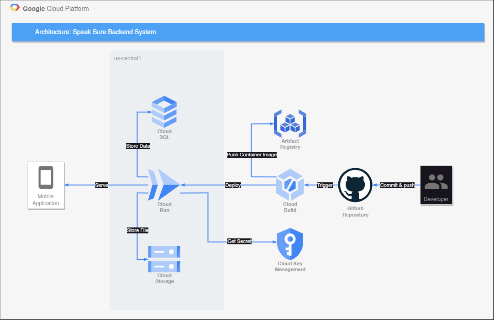

## API Documentation

url : https://speak-sure-dzjerbarfq-uc.a.run.app

<details>

<summary>POST /auth/register</summary>

### POST /auth/register

#### Body
| Key         	| Type    	| Default 	| Required 	| Description                     	|
|--------------	|---------	| ---------	|----------	|---------------------------------	|
| name        	| String  	|         	| Yes      	| Name of the user                  |
| email       	| String    |          	| Yes      	| User email                       	|
| password     	| String  	|          	| Yes       | User password                   	|

#### Successful response
> Register successfully (201)
> ```JSON
> {
>   "statusCode": 201,
>   "data": [
>     {
>       "id": 123,
>       "access_token": "xxx"
>     }
>   ]
> }
> ```

#### Failed response
> Required field didn't filled properly (400)
> ```JSON
> {
>   "statusCode": 400,
>   "message": [
>       "xxx",
>       "xxx",
>   ],
>   "error": "Bad Request"
> }
> ```

> Email already exists (400)
> ```JSON
> {
>   "statusCode": 400,
>   "message": "Email already exists"
> }
> ```

</details>

<details>
<summary>POST /auth/login</summary>

### POST /auth/login

#### Body
| Key         	| Type    	| Default 	| Required 	| Description                     	|
|--------------	|---------	| ---------	|----------	|---------------------------------	|
| email       	| String    |          	| Yes      	| User email                        |
| password     	| String  	|          	| Yes       | User password                  	  |

#### Successful response
> Login successfully (200)
> ```JSON
> {
>   "statusCode": 200,
>   "data": [
>     {
>       "id": 123,
>       "access_token": "xxx"
>     }
>   ]
> }
> ```

#### Failed response
> Wrong Username / Password (400)
> ```JSON
> {
>   "statusCode": 401,
>   "message": "Unauthorized"
> }
> ```

> Required field didn't filled properly (400)
> ```JSON
> {
>   "statusCode": 400,
>   "message": [
>       "xxx",
>       "xxx",
>   ],
>   "error": "Bad Request"
> }
> ```

</details>

<details>
<summary>PATCH /user/{user_id}</summary>

### PATCH /user/{user_id}

#### Header
| Name         	| Type    	| Default 	| Required 	| Value                            	|
|--------------	| --------- | ---------	|----------	|---------------------------------	|
| Authorization | Bearer  	|         	| Yes      	| Auth token from register or login |


#### Params
| Name         	| Type    	| In      	| Default 	| Required 	| Description                     	|
|--------------	| --------- |---------	| ---------	|----------	|---------------------------------	|
| user_id       | Integer  	| Uri     	|         	| Yes      	| The ID of user                    |

#### Body
| Name         	| Type    	| Default 	| Required 	| Description                     	|
|--------------	| --------- | ---------	|----------	|---------------------------------	|
| name        	| String  	|          	| No        | Name of user                      |
| email        	| String  	|          	| No        | Email of user                     |
| password     	| String  	|          	| No        | Password of user                  |
| image        	| File    	|          	| No        | Profile picture of user           |
| audio        	| File    	|          	| No        | Profile audio of user             |
| badge        	| Number   	|          	| No        | Id of the badge                   |

#### Response
##### Successful response
> Successfully change user data  (200)
> ```JSON
> {
>   "statusCode": 200,
>   "data": [
>     {
>       "id": 1,
>       "name": "xxx",
>       "email": "xxx@xxx.xxx",
>       "audio": "xxx",
>       "audio_length": 12.3,
>       "image": "xxx",
>       "status": "xxx",
>       "badge": "123",
>       "created_at": "123",
>       "updated_at": "123"
>     }
>   ]
> }
> ```
##### Failed response
> Id from token does not match user_id  (403)
> ```JSON
> {
>   "statusCode": 403,
>   "message": "Forbidden"
> }
> ```

</details>

<details>
<summary>GET /user/{user_id}</summary>

### GET /user/{user_id}

#### Header
| Name         	| Type    	| Default 	| Required 	| Value                            	|
|--------------	| --------- | ---------	|----------	|---------------------------------	|
| Authorization | Bearer  	|         	| Yes      	| Auth token from register or login |


#### Params
| Name         	| Type    	| In      	| Default 	| Required 	| Description                     	|
|--------------	| --------- |---------	| ---------	|----------	|---------------------------------	|
| user_id       | Integer  	| Uri     	|         	| Yes      	| The ID of user                    |

#### Response
##### Successful response
> Successfully get user data (200)
> ```JSON
> {
>   "statusCode": 200,
>   "data": {
>     "id": 1,
>     "name": "xxx",
>     "email": "xxx@xxx.xxx",
>     "audio": "xxx",
>     "audio_length": "xxx",
>     "image": "xxx",
>     "status": "xxx",
>     "threads_count": "123",
>     "comments_count": "123",
>     "created_at": "123",
>     "updated_at": "123",
>     "badge": {
>         "id": 1,
>         "title": "xxx",
>         "image": "xxx"
>     }
>   }
> }
> ```
##### Failed response
> Id from token does not match user_id  (403)
> ```JSON
> {
>   "statusCode": 403,
>   "message": "Forbidden"
> }
> ```

</details>

<details>
<summary>DELETE /user/{user_id}</summary>

### DELETE /user/{user_id}

#### Header
| Name         	| Type    	| Default 	| Required 	| Value                            	|
|--------------	| --------- | ---------	|----------	|---------------------------------	|
| Authorization | Bearer  	|         	| Yes      	| Auth token from register or login |


#### Params
| Name         	| Type    	| In      	| Default 	| Required 	| Description                     	|
|--------------	| --------- |---------	| ---------	|----------	|---------------------------------	|
| user_id       | Integer  	| Uri     	|         	| Yes      	| The ID of user                    |

#### Response
##### Successful response
> Successfully delete the user  (204)
##### Failed response
> Id of token does not match user_id  (403)
> ```JSON
> {
>   "statusCode": 403,
>   "message": "Forbidden"
> }
> ```

> User doesn't exists (400)
> ```JSON
> {
>     "statusCode": 400,
>     "message": "User doesn't exists"
> }
> ```

</details>

<details>
<summary>POST /threads</summary>

### POST /threads

#### Header
| Name         	| Type    	| Default 	| Required 	| Value                            	|
|--------------	| --------- | ---------	|----------	|---------------------------------	|
| Authorization | Bearer  	|         	| Yes      	| Auth token from register or login |


#### Body
| Key         	| Type    	| Default 	| Required 	| Description                     	|
|--------------	|---------	| ---------	|----------	|---------------------------------	|
| title        	| String  	|         	| Yes      	| Name of thread                    |
| description 	| String    |          	| Yes      	| Description of thread             |
| topic        	| String  	|          	| Yes       | Topic of thread                   |
| image        	| File    	|          	| No        | Image of thread                   |
| audio        	| File    	|          	| No        | Audio of thread                   |

#### Response
##### Successful response

> Successfully created new thread  (201)
> ```JSON
> {
>   "statusCode": 201,
>   "data": [
>     {
>       "id": ,
>       "title": "xxx",
>       "description": "xxx",
>       "topic": "xxx",
>       "image": "xxx",
>       "audio": "xxx",
>       "audio_length": 12.3
>     }
>   ]
> }
> ```

> audio_length is provided in seconds

##### Failed response
> Invalid Token (401)
> ```JSON
> {
>   "statusCode": 401,
>   "message": "Unauthorized"
> }
> ```

> Required field didn't filled properly (400)
> ```JSON
> {
>   "statusCode": 400,
>   "message": [
>     "title should not be empty",
>     "description should not be empty",
>     "topic should not be empty"
>   ],
>   "error": "Bad Request"
> }
> ```

> Topic doesn't exists (400)
> ```JSON
> {
>   "statusCode": 400,
>   "message": "The topic doesn't exists"
> }
> ```

> Incompatible Files (422)
> ```JSON
> {
>   "statusCode": 422,
>   "message": "audio is not a valid document. Accepted file format [mp3,wav,mpeg]"
> }
> ```

</details>

<details>
<summary>PATCH /threads/{thread_id}</summary>

### PATCH /threads/{thread_id}

#### Header
| Name         	| Type    	| Default 	| Required 	| Value                            	|
|--------------	| --------- | ---------	|----------	|---------------------------------	|
| Authorization | Bearer  	|         	| Yes      	| Auth token from register or login |

#### Params
| Name         	| Type    	| In      	| Default 	| Required 	| Description                     	|
|--------------	| --------- |---------	| ---------	|----------	|---------------------------------	|
| thread_id     | Integer  	| Uri     	|         	| Yes      	| The ID of thread                  |

#### Body
| Key         	| Type    	| Default 	| Required 	| Description                     	|
|--------------	|---------	| ---------	|----------	|---------------------------------	|
| title        	| String  	|         	| No      	| Name of thread                    |
| description 	| String    |          	| No      	| Description of thread             |
| topic        	| String  	|          	| No        | Topic of thread                   |
| image        	| File    	|          	| No        | Image of thread                   |
| audio        	| File    	|          	| No        | Audio of thread                   |

#### Response
##### Successful response

> Successfully updated the thread  (200)
> ```JSON
> {
>   "statusCode": 201,
>   "data": {
>     "id": 1,
>     "title": "xxx",
>     "description": "xxx",
>     "topic": "123",
>     "image": "xxx",
>     "audio": "xxx",
>     "audio_length": 12.3,
>     "updated_at": "123"
>   }
> }
> ```

> audio_length is provided in seconds

##### Failed response

> Thread doesn't exists (400)
> ```JSON
> {
>     "statusCode": 400,
>     "message": "Thread doesn't exists"
> }
> ```

> Topic doesn't exists (400)
> ```JSON
> {
>   "statusCode": 400,
>   "message": "The topic doesn't exists"
> }
> ```

</details>

<details>
<summary>GET /threads</summary>

### GET /threads

#### Params
| Name         	| Type    	| In      	| Default 	| Required 	| Description                     	|
|--------------	| --------- |---------	| ---------	|----------	|---------------------------------	|
| page          | string   	| Query   	| 0        	| No      	| The index of page of list thread  |
| size          | string   	| Query   	| 5        	| No      	| Max thread in one page            |
| keyword       | string   	| Query   	|         	| No      	| Keyword for search the thread     |
| topic         | string   	| Query   	|           | No      	| The topic of the thread           |

#### Response
##### Successful response

> Successfully get the thread  (200)
> ```JSON
> {
>   "statusCode": 200,
>   "data": [
>     {
>       "id": 1,
>       "title": "xxx",
>       "description": "xxx",
>       "comments_count": "123",
>       "likes_count": "123",
>       "image": "xxx",
>       "audio": "xxx",
>       "audio_length": 12.3,
>       "created_at": "123",
>       "updated_at": "123",
>       "user": {
>           "name": "xxx",
>           "image": "xxx"
>       },
>       "topic": {
>           "id": 1,
>           "name": "xxx"
>       }
>     }
>   ]
> }
> ```

> audio_length is provided in seconds

</details>

<details>
<summary>GET /threads/{thread_id}</summary>

### GET /threads

#### Params
| Name         	| Type    	| In      	| Default 	| Required 	| Description                     	|
|--------------	| --------- |---------	| ---------	|----------	|---------------------------------	|
| thread_id     | string   	| Uri     	|         	| Yes      	| The id of the thread              |
#### Response

##### Successful response

> Successfully get the thread  (200)
> ```JSON
> {
> "statusCode": 200,
>   "data": {
>     "id": 1,
>     "title": "xxx",
>     "description": "xxx",
>     "comments_count": "123",
>     "likes_count": "123",
>     "topic": "xxx",
>     "image": "xxx",
>     "audio": "xxx",
>     "audio_length": "123",
>     "created_at": "123",
>     "updated_at": "123",
>     "user": {
>         "name": "xxx",
>         "image": "xxx"
>     }
>   }
> }
> ```

> audio_length is provided in seconds

##### Failed response

> Thread doesn't exists (400)
> ```JSON
> {
>   "statusCode": 400,
>   "message": "Thread doesn't exists"
> }
> ```

</details>

<details>
<summary>DELETE /threads/{thread_id}</summary>

### DELETE /threads/{thread_id}

#### Header
| Name         	| Type    	| Default 	| Required 	| Value                            	|
|--------------	| --------- | ---------	|----------	|---------------------------------	|
| Authorization | Bearer  	|         	| Yes      	| Auth token from register or login |

#### Params
| Name         	| Type    	| In      	| Default 	| Required 	| Description                     	|
|--------------	| --------- |---------	| ---------	|----------	|---------------------------------	|
| thread_id     | Integer  	| Uri     	|         	| Yes      	| The ID of thread                  |

#### Response
##### Successful response
> Successfully delete the thread  (204)
##### Failed response

> Id from the token does not match with the creator of thread  (403)
> ```JSON
> {
>   "statusCode": 403,
>   "message": "Forbidden"
> }
> ```

> Thread doesn't exists (400)
> ```JSON
> {
>     "statusCode": 400,
>     "message": "Thread doesn't exists"
> }
> ```


</details>

<details>
<summary>POST /threads/{thread_id}/likes</summary>

### POST /threads/{thread_id}/likes

#### Header
| Name         	| Type    	| Default 	| Required 	| Value                            	|
|--------------	| --------- | ---------	|----------	|---------------------------------	|
| Authorization | Bearer  	|         	| Yes      	| Auth token from register or login |

#### Params
| Name         	| Type    	| In      	| Default 	| Required 	| Description                     	|
|--------------	| --------- |---------	| ---------	|----------	|---------------------------------	|
| thread_id     | Integer  	| Uri     	|         	| Yes      	| The ID of thread                  |

#### Response
##### Successful response
> Successfully like the thread (201)
```JSON
{
  "statusCode": 201,
  "data": {
    "thread_id": 1
  }
}
```
##### Failed response

> Thread doesn't exists (400)
> ```JSON
> {
>   "statusCode": 400,
>   "message": "Thread doesn't exists"
> }
> ```

> Already liked the Thread (400)
> ```JSON
> {
>   "statusCode": 400,
>   "message": "Thread already liked"
> }
> ```

</details>

<details>
<summary>DELETE /threads/{thread_id}/likes</summary>

### DELETE /threads/{thread_id}/likes

#### Header
| Name         	| Type    	| Default 	| Required 	| Value                            	|
|--------------	| --------- | ---------	|----------	|---------------------------------	|
| Authorization | Bearer  	|         	| Yes      	| Auth token from register or login |

#### Params
| Name         	| Type    	| In      	| Default 	| Required 	| Description                     	|
|--------------	| --------- |---------	| ---------	|----------	|---------------------------------	|
| thread_id     | Integer  	| Uri     	|         	| Yes      	| The ID of thread                  |

#### Response
##### Successful response
> Successfully unlike the thread  (204)
##### Failed response

> Thread doesn't exists (400)
> ```JSON
> {
>   "statusCode": 400,
>   "message": "Thread doesn't exists"
> }
> ```

> Thread didn't liked yet (400)
> ```JSON
> {
>   "statusCode": 400,
>   "message": "Thread didn't liked yet"
> }
> ```

</details>

<details>
<summary>POST /topics</summary>

### POST /topics

#### Body
| Key         	| Type    	| Default 	| Required 	| Description                     	|
|--------------	|---------	| ---------	|----------	|---------------------------------	|
| name        	| String  	|         	| Yes      	| Name of the topic                  |

#### Successful response
> Topic created successfully (201)
> ```JSON
> {
>   "statusCode": 201,
>   "data": {
>     "name": "xxx",
>     "id": 1
>   }
> }
> ```

#### Failed response
> Required field didn't filled properly (400)
> ```JSON
> {
>   "statusCode": 400,
>   "message": [
>       "xxx",
>   ],
>   "error": "Bad Request"
> }
> ```

> Topic already exists (400)
> ```JSON
> {
>   "statusCode": 400,
>   "message": "The topic already exists"
> }
> ```

</details>

<details>
<summary>PATCH /topics/{topic_id}</summary>

### PATCH /topics/{topic_id}

#### Params
| Name         	| Type    	| In      	| Default 	| Required 	| Description                     	|
|--------------	| --------- |---------	| ---------	|----------	|---------------------------------	|
| topic_id      | Integer  	| Uri     	|         	| Yes      	| The ID of topic                   |
#### Body
| Key         	| Type    	| Default 	| Required 	| Description                     	|
|--------------	|---------	| ---------	|----------	|---------------------------------	|
| name        	| String  	|         	| No      	| Name of the topic                 |

#### Successful response
> Topic updated successfully (200)
> ```JSON
> {
>   "statusCode": 200,
>   "data": {
>     "name": "xxx",
>     "id": 1
>   }
> }
> ```

#### Failed response
> Topic doesn't exists (400)
> ```JSON
> {
>   "statusCode": 400,
>   "message": "The topic doesn't exists"
> }
> ```

</details>


<details>
<summary>GET /topics</summary>

### GET /topics

#### Successful response
> Successfully get topic data (200)
> ```JSON
> {
>   "statusCode": 200,
>   "data": [
>      {
>        "name": "xxx",
>        "id": 1
>      }
>   ]
> }
> ```

</details>

<details>
<summary>DELETE /topics/{topic_id}</summary>

### DELETE /topics

#### Params
| Name         	| Type    	| In      	| Default 	| Required 	| Description                     	|
|--------------	| --------- |---------	| ---------	|----------	|---------------------------------	|
| topic_id      | Integer  	| Uri     	|         	| Yes      	| The ID of topic                   |

#### Successful response
> Topic updated successfully (204)

#### Failed response

> Topic doesn't exists (400)
> ```JSON
> {
>   "statusCode": 400,
>   "message": "The topic doesn't exists"
> }
> ```

</details>

<details>
<summary>POST /threads/{threadId}/comment</summary>

### POST /threads/:threadId/comment

#### Header
| Name         	| Type    	| Default 	| Required 	| Value                            	|
|--------------	| --------- | ---------	|----------	|---------------------------------	|
| Authorization | Bearer  	|         	| Yes      	| Auth token from register or login |


#### Params

| Name     | Type    | Default | Required | Description              |
| -------- | ------- | ------- | -------- | ------------------------ |
| threadId | Integer |         | Yes      | Thread ID of the comment |
| text     | String  |         | Yes      | Message                  |
| audio    | File    |         | No       | Audio of the comment                         |

#### Successful response
> Successfully created new thread  (201)
> ```JSON
> {
>   "statusCode": 201,
>   "data": [
>     {
>       "id": ,
>       "threadId": "xxx",
>       "text": "xxx",
>       "audio": "xxx",
>     }
>   ]
> }
> ```

##### Failed response
> Invalid Token (401)
> ```JSON
> {
>   "statusCode": 401,
>   "message": "Unauthorized"
> }
> ```

> Required field didn't filled properly (400)
> ```JSON
> {
>   "statusCode": 400,
>   "message": [
>     "text should not be empty"
>   ],
>   "error": "Bad Request"
> }
> ```

> Thread doesn't exists -> Stuck :\

> Incompatible Files (422)
> ```JSON
> {
>   "statusCode": 422,
>   "message": "audio is not a valid document. Accepted file format [mp3,wav,mpeg]"
> }
> ```

</details>

## Infrastructure Documentation


